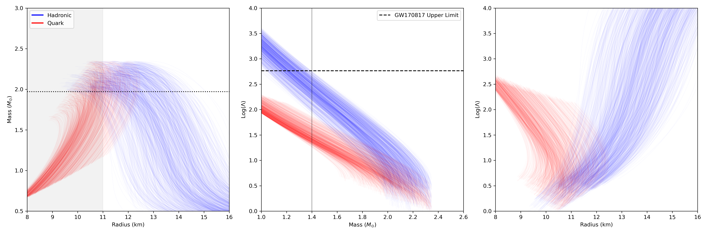
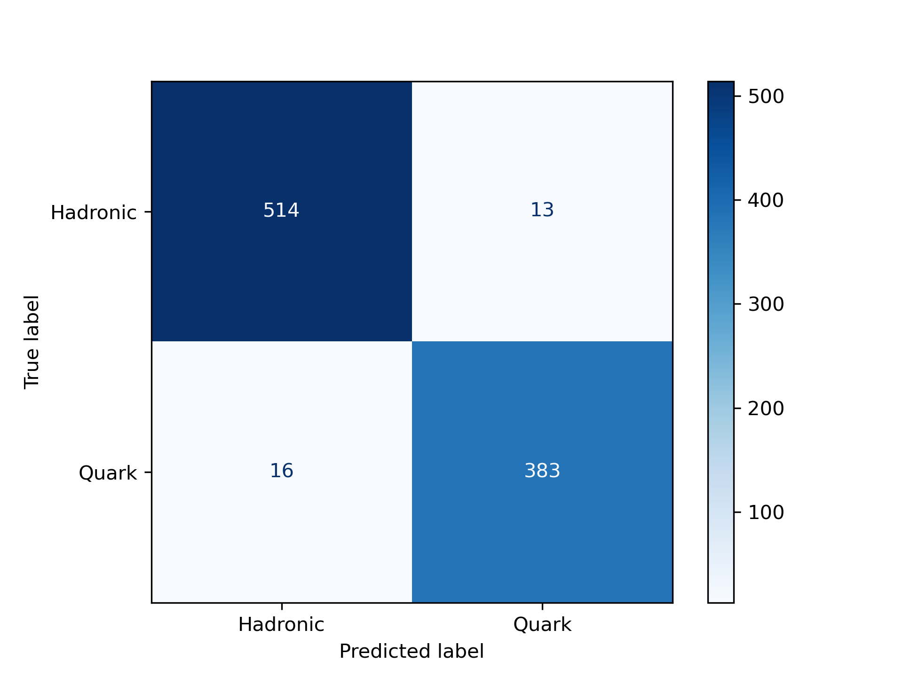
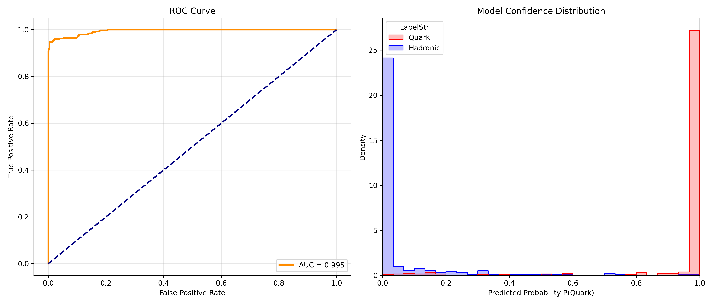

# Machine Learning Classification of Neutron Star Equations of State


**Bachelor Thesis Project**
**Author:** Ioannis Papathanasiou
**Institution:** Aristotle University of Thessaloniki (AUTH)
**Department:** Theoretical Physics 

---

##  Abstract
This repository contains the computational pipeline developed for Chapter 6 of my thesis. The goal is to classify Neutron Star Equations of State (EoS) as either **Hadronic** (standard nuclear matter) or **Quark** (exotic matter) using macroscopic observables.

The pipeline generates synthetic stellar populations using General Relativistic (TOV) solvers, enforces strict astrophysical constraints (GW170817, PSR J0740+6620), and trains a Random Forest Classifier to distinguish the microphysics based on Mass ($M$), Radius ($R$), and Tidal Deformability ($\Lambda$).

##  Key Results
The model was applied to real astrophysical candidates. The inference suggests **HESS J1731-347** is a strong candidate for a Quark Star due to its small radius, while **GW170817** resides in the confusion region where both models are physically degenerate.

| Candidate Object | Mass ($M_{\odot}$) | Radius (km) | P(Quark) | Verdict |
| :--- | :--- | :--- | :--- | :--- |
| **GW170817** | 1.40 | 11.90 | **58.6%** | Ambiguous |
| **HESS J1731-347** | 0.77 | 10.40 | **95.3%** | **QUARK** |
| **PSR J0740+6620** | 2.08 | 12.35 | 32.6% | Hadronic |
| **PSR J0030+04** | 1.44 | 13.02 | 22.4% | Hadronic |

##  Physics & Methodology

### 1. Data Generation (The "Physics Manifold")
*   **Hadronic EoS:** Generated using a **Logarithmic Mixing** technique of 21 analytic nuclear models (Skyrme, RMF, etc.) + Homologous perturbation.
    *   *Constraints:* $R_{1.4} \geq 11.0$ km, $\Lambda_{1.4} \leq 580$, $M_{max} \geq 1.97 M_{\odot}$.
*   **Quark EoS:** Generated using the **Constant Speed of Sound (CSS)** model.
    *   *Constraints:* $c_s^2 \in [0.33, 1.0]$, $R_{max} < 12.5$ km.

### 2. Machine Learning
*   **Model:** Random Forest Classifier ($N_{est}=200$, Depth=12).
*   **Validation:** **Group-Shuffle-Split** cross-validation prevents data leakage by ensuring points from the same EoS curve never appear in both training and test sets.
*   **Performance:** AUC: **0.995**, Accuracy: **97%**.

##  Visualizations

### The Physics Manifold & Constraints
The plot below visualizes the generated Equation of State curves. Note the "gap" between Hadronic (Blue) and Quark (Red) models at low masses, which allows the classifier to identify HESS J1731.




### Model Diagnostics
Confusion Matrix and ROC Curve demonstrating model performance.



.

##  Repository Structure

```text
neutron_ml/
└── Thesis_Code/
    ├── data/               # Stores the generated synthetic dataset (csv)
    ├── plots/              # Output directory for diagnostic figures
    ├── src/
    │   ├── const.py        # Physical constants and astrophysical constraints
    │   ├── physics.py      # TOV solver and EoS generation logic (Scipy/Sympy)
    │   ├── ml_pipeline.py  # Random Forest training and Monte Carlo inference
    │   └── visualize.py    # Plotting engines (Violin plots, ROC, Spaghetti plots)
    ├── main.py             # Execution entry point
    └── requirements.txt    # Python dependencies
